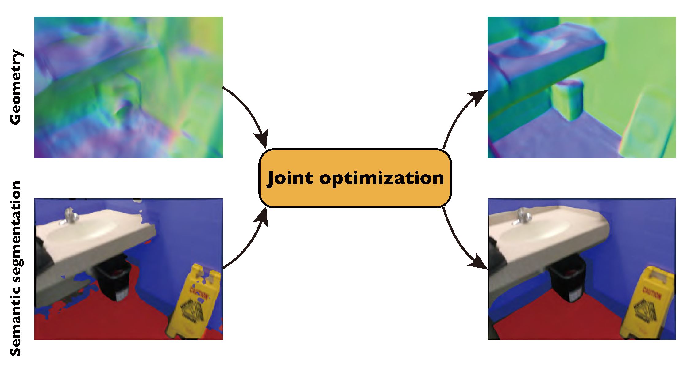

# Neural 3D Scene Reconstruction with the Manhattan-world Assumption
### [Project Page](https://zju3dv.github.io/manhattan_sdf) | [Video](https://www.youtube.com/watch?v=oEE7mK0YQtc) | [Paper](https://arxiv.org/abs/xxx)
<br/>



> [Neural 3D Scene Reconstruction with the Manhattan-world Assumption](https://arxiv.org/abs/xxx)  
> [Haoyu Guo](https://github.com/ghy0324)<sup>\*</sup>, [Sida Peng](https://pengsida.net)<sup>\*</sup>, [Haotong Lin](https://github.com/haotongl), [Qianqian Wang](http://www.cs.cornell.edu/~qqw/), [Guofeng Zhang](http://www.cad.zju.edu.cn/home/gfzhang/), [Hujun Bao](http://www.cad.zju.edu.cn/home/bao/), [Xiaowei Zhou](https://xzhou.me)  
> CVPR 2022 (Oral Presentation)
<br/>

## Setup

### Installation
```shell
conda env create -f environment.yml
conda activate manhattan
```

### Data preparation

Coming soon!

## Usage

### Training

```shell
python train_net.py --cfg_file configs/scannet/0050.yaml gpus 0, exp_name scannet_0050
```

### Mesh Extraction

```shell
python run.py --type mesh_extract --output_mesh result.obj --cfg_file configs/scannet/0050.yaml gpus 0, exp_name scannet_0050
```

### Evaluation

```shell
python run.py --type evaluate --cfg_file configs/scannet/0050.yaml gpus 0, exp_name scannet_0050
```


## Citation

If you find this code useful for your research, please use the following BibTeX entry.

```
@inproceedings{guo2022manhattan,
  title={Neural 3D Scene Reconstruction with the Manhattan-world Assumption},
  author={Guo, Haoyu and Peng, Sida and Lin, Haotong and Wang, Qianqian and Zhang, Guofeng and Bao, Hujun and Zhou, Xiaowei},
  booktitle={CVPR},
  year={2022}
}
```

<!-- ## Acknowledgement -->
